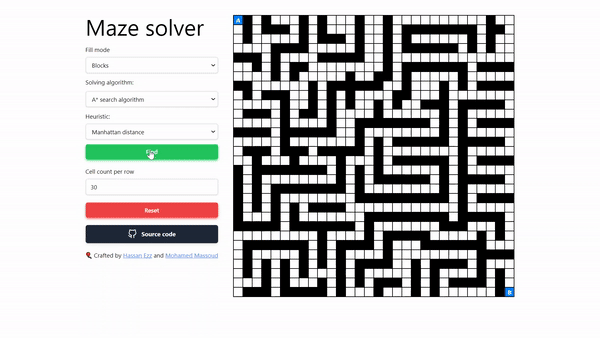

# Visual maze solver

A maze solving visualizer, using the A* ,Dijkstra and BFS algorithm.



# Screenshots


## Settings

In the constants file, you can find two settings,
  - `DEFAULT_SIZE` which the default size of the matrix
  - `MAX_SIZE` which is the max size the app can accept
  - `DELAY` which is the delay time in milliseconds

You can also change the grid color scheme.

```ts
// src/constants.ts

export const DEFAULT_SIZE = 10
export const MAX_SIZE = 50
export const DELAY = 0

export const TARGET_LOCATION_COLOR = "#0080ff"
export const PATH_COLOR = "#ef4444"
export const VISITED_CELL_COLOR = "#fde047"
```

## Future plans

I'm always open to new contributions and ideas for implementing new features. If you have a cool idea for a new feature or algorithm that you'd like to see added to the app, please let me know. I'd love to hear from you and work together to make this app even more awesome.

- [ ] Add a maze generation algorithm
- [ ] Replace select box with radio box
- [ ] Use walls instead of blocks to improve performance


